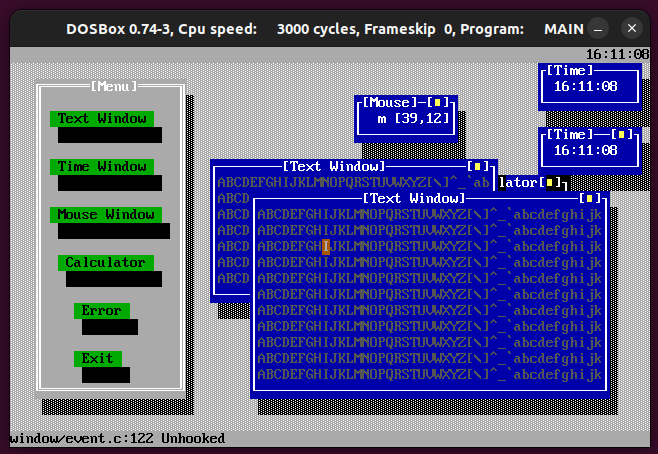

# 90's Windows

Stuck on a sailboat in the middle of the ocean for ten days with a copy of Bruce's C Compiler and a copy of Ralf Brown's Interrupt List, what to do?

It started out trying to use assembly to read the mouse, ended up building a little window system between watches...

This is not complete, maintained, or being further developed, it's just a bit of nostalgia, an example of some of the stuff we used to do in the early 90's.

If you're brave enough to run it you will need a copy of Bruce's C compiler and DOSBox installed and execute the following command;

$ cd src && make

If you have cc, gcc, and clang installed you can just type make and it will search for warnings/errors with the other three compilers.

x86 assembly, interrupt routines, dos, old school text windows
